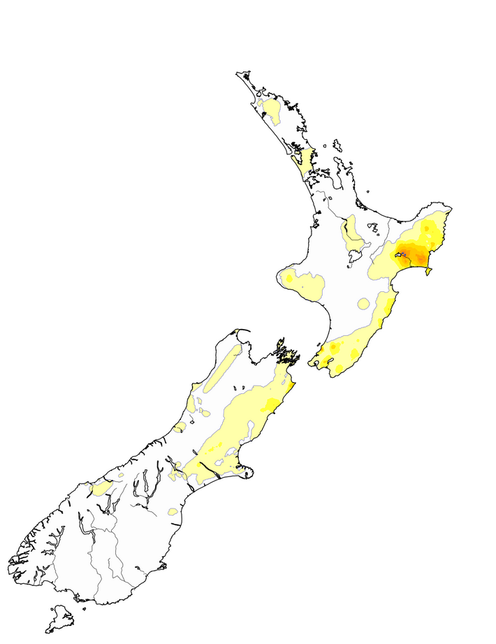

## MDDN 242 Project 1: Time-based Media  

Clocks Name: A Radar that doesn't actually detect anything

Toby Balls, 300494308

This project involved creating a clock in P5.js, starting from original sketches and developing them further until we created our own unique, fuctional clock. My clock functions similar to a radar display, with a sweeping arm that completes a 360 degree rotation every second, with the second, minute and hour hands represented as 'blips' or 'contacts' on the radar display. My clock also has a functioning alarm, that when triggered displays lots of text including "THERE'S SOMETHING ON THE RADAR" and "OH MY GOD" and also .............................. (should be changes color between red and green, if i can get that working) 

I play a lot of games that make use of radar systems frequently, and the idea of turning a radar into a clock seemed like a fairly straightforward job programming wise. At first I was struggling to decide between a radar-like design or a heat map-like design. I quite liked the idea of a heat map like yuou would find in a weather forecast, with temperatures being cold across the clock, and increasing to represent the position of the seconds/minute/hours arms (See Capture.PNG for reference, which shows a heat map of cumulative rainfall across NZ from MetService). However I couldn't find a way to easily change the colours across a gradient and also have the colour changes be based on time values. I am generally happy with the end result, the spinning arm functions perfectly, the blips appear as they should and the alarm triggers when and as expected. 

However, there are a few changes I would've liked to make given more time. The transparency of the 'contacts' is the reverse of how I would've liked it to be, they should start at maximum opacity and become more transparent, but they start completely transparent and then become more opaque. I would've also liked to add a tail to the spinning arm, almost like a residual glow it leaves behind as it spins. The final change/addition, albeit a far more complicated one than the first two changes, would've been to add a glowing effect to the whole clock, just some ambient illumination to add another layer to the radar aesthetic of the clock. There also seems to be a randomly occuring bug, where the spinning arm resets back to the top position within a second or so of the clock being opened, but it only happens somethimes, and the amount of time that passes before it resets seems to be random, but always happens within about a second. I'm not sure whats causing it and I haven't been able to get it to occur reliably, sometimes the clock functions as expected, sometimes it doesn't

Some of my biggest challenges were the change in transparency of the 'contacts' and having them appear as the arm passed their expected position. At first I had the 'contacts' appear when the arm reached the top position on the clock, but by mapping the transparency to the value of milliseconds - the position of the seconds/minutes/hours 'contact', I was able to make them appear when the arm moved over their expected position instead, which I think makes my clock function much more closely to an actual radar.

Overall this project was a fun challenge, having the freedom to come up with basically whatever design of clock we wanted was really cool, and my radar theme presented some problems I wouldnt have expected but were enjoyable to overcome. 

